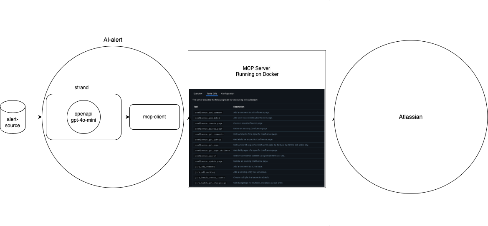

# AI Alert Assistant

A modern, Python-based AI assistant that analyzes system alerts and provides intelligent responses based on Confluence documentation.

# System Architecture



The AI Alert Assistant follows a modular architecture with the following key components:

- **AI Agents**: Handle alert analysis and response generation
- **MCP Integration**: Provides seamless Atlassian Confluence connectivity
- **Tools Layer**: Manages external integrations and data sources
- **Utilities**: Core services like logging and configuration management

## Quick Start

### 1. Clone and Setup

```bash
# Clone the repository
git clone <repository-url>
cd atlassian-agent

# Create virtual environment
python -m venv venv
source venv/bin/activate  # On Windows: venv\Scripts\activate

# Install the application
pip install -e .
```

### 2. Configure Environment

Create a `.env` file in the project root:

```bash
# Model Configuration
MODEL_TYPE=openai  # or ollama
OPENAI_API_KEY=your_openai_api_key_here
OPENAI_MODEL=gpt-4

# Atlassian Configuration
CONFLUENCE_URL=https://your-domain.atlassian.net

# Application Configuration
LOG_LEVEL=INFO
```

### 3. Run the Application

```bash
# Interactive mode
ai-alert

# Batch mode with specific alert
ai-alert "High CPU usage detected on production server"

# Alternative: run directly without installing
python -m src.main
```

## Features

- **AI-Powered Analysis**: Uses Strands agents with OpenAI/Ollama models
- **Confluence Integration**: MCP-based integration with Atlassian Confluence
- **Smart Alert Classification**: Automatic event ID mapping and pattern recognition for system alerts
- **Multi-System Support**: Handles alerts from applications, networks, storage, authentication, and more
- **Structured Troubleshooting**: Step-by-step guidance based on documentation

## Project Structure

```
atlassian-agent/
├── src/                     # Main application package
│   ├── agents/              # AI agents (analysis, response)
│   ├── tools/               # MCP clients and integrations
│   ├── utilities/           # Logging, models, configuration
│   └── main.py              # Application entry point
├── venv/                    # Virtual environment
├── pyproject.toml           # Modern Python packaging
├── requirements.txt         # Production dependencies
└── README.md               # This file
```

## Alert Classification System

The system automatically classifies alerts into categories:

- **SYS-001**: High CPU Usage
- **SYS-002**: Memory Pressure Critical
- **NET-001**: Connection Limit Reached
- **NET-002**: Network/Timeout Issues
- **STO-001**: Disk Space Low
- **APP-001**: Service/Application Down
- **AUTH-001**: Authentication Issues
- **ALERT-UNKNOWN**: Unclassified alerts

## Command Line Options

```bash
ai-alert --help

usage: ai-alert [-h] [--log-level {DEBUG,INFO,WARNING,ERROR,CRITICAL}] [alert]

AI Alert Assistant - System Alert Analysis

positional arguments:
  alert                 Alert message to analyze (if not provided, starts interactive mode)

optional arguments:
  -h, --help            show this help message and exit
  --log-level {DEBUG,INFO,WARNING,ERROR,CRITICAL}
                        Set logging level
```

## Development

### Install Development Dependencies

```bash
pip install -r requirements-dev.txt
```

## Configuration

### Model Configuration

The application supports two AI model providers:

#### OpenAI (Recommended)
```bash
MODEL_TYPE=openai
OPENAI_API_KEY=your_api_key_here
OPENAI_MODEL=gpt-4
```

#### Ollama (Local)
```bash
MODEL_TYPE=ollama
OLLAMA_MODEL=llama2
OLLAMA_BASE_URL=http://localhost:11434
```

### Atlassian Integration

The application uses MCP (Model Context Protocol) to integrate with Atlassian Confluence:

- Discovers available Confluence spaces automatically
- Searches across all documentation pages
- Retrieves specific page content for analysis
- Provides real-time access to your runbooks

## Event ID Classification

The system automatically classifies alarms into event IDs:

- **DB-001**: High CPU Usage (>90%)
- **DB-002**: Memory Pressure Critical
- **DB-003**: Connection Limit Reached
- **DB-004**: Disk Space Low (<10%)
- **DB-005**: Replication Lag (>5 min)
- **DB-006**: Deadlock Detection
- **DB-007**: Backup Failure

## Architecture

### Components

1. **DatabaseAnalysisAgent**: Main AI agent that analyzes alarms
2. **AtlassianMCPClient**: MCP client for Confluence integration
3. **ModelConfig**: Centralized model configuration and management
4. **Logger**: Structured, colored logging system

### Key Features

- **Modular Design**: Clean separation of concerns
- **Async Support**: Full async/await support for better performance
- **Error Handling**: Comprehensive error handling and logging
- **Extensible**: Easy to add new agents, tools, or integrations
- **Type Safe**: Full type hints for better development experience

## Troubleshooting

### Common Issues

#### Authentication Failed
```bash
ERROR: Atlassian authentication failed
```
**Solution**: Make sure you have access to a Confluence site and complete the OAuth flow in the browser.

#### Model Not Found
```bash
ERROR: Failed to create model: OPENAI_API_KEY environment variable is required
```
**Solution**: Set your API key in the `.env` file or use Ollama locally.

#### Import Errors
```bash
ModuleNotFoundError: No module named 'strands'
```
**Solution**: Make sure you're in the virtual environment and have installed dependencies.

### Debug Mode

Run with debug logging to see detailed information:

```bash
python -m src.ai_dba.main --log-level DEBUG
```

## Contributing

1. Fork the repository
2. Create a feature branch
3. Make your changes
4. Run tests and linting
5. Submit a pull request

## License

MIT License - see LICENSE file for details.